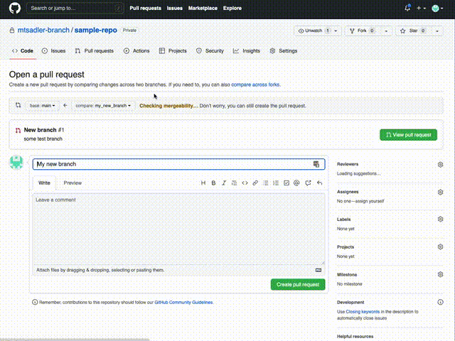
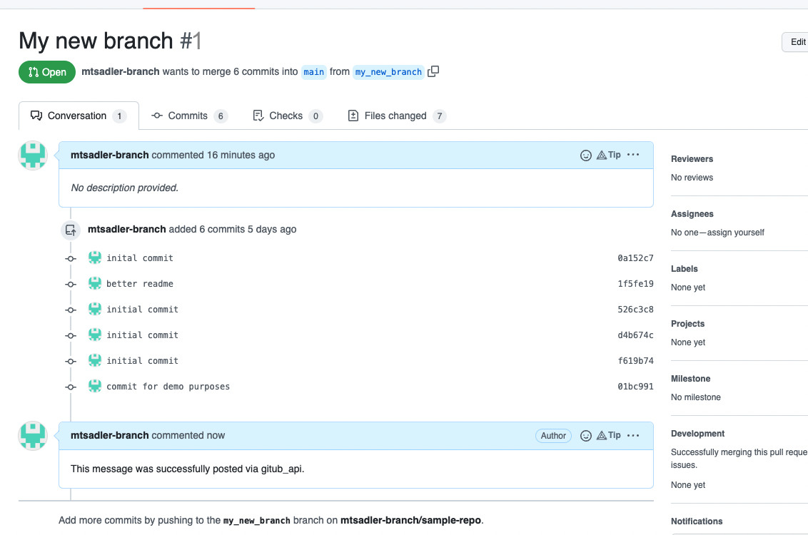

# github_api
Python Script for interacting with Github API.
  ---  
Release Details:  


  --- 
Repo Details:  


  ---  
Social Media:  
[](https://twitter.com/intent/tweet?text=Wow:&url=https%3A%2F%2Fgithub.com%2Forg-not-included%2Fpy-github-helper%2F)
  ---  
## Example Code Usage:
```text
from py_github_helper.utils.commands import add_comment

add_comment(
    organization="org-not-included",
    repository="py-github-helper",
    pull_request_id="2",
    message="This is an automated message via Github API",
    token="my_github_token",
    username=None,
    password=None,
)
```
  
---
  
## Example CLI Usage:
```shell
python3 -m py-github-helper \
        -t $GH_TOKEN -o org-not-included -r py-github-helper -l 2 -c add_comment \
        -e '{"message": "This is an automated message via Github API"}'
```
  
---  
  
## Example Comment:
```text
https://github.com/org-not-included/py-github-helper/pull/2#issuecomment-1236262158
```
  
---  
  
## Docs
```shell
python3 -m py-github-helper --help
```
  
---  
  
```text
usage: python3 -m py-github-helper [-h] [-o ORGANIZATION] [-r REPOSITORY] [-t TOKEN] [-u USERNAME] [-p PASSWORD] [-l PULL_REQUEST_ID] [-c COMMAND] [-e EXTRAS]

A python script that handles GitHub API calls.

optional arguments:
  -h, --help            show this help message and exit
  -o ORGANIZATION, --organization ORGANIZATION
                        Owner of GitHub repository.
  -r REPOSITORY, --repository REPOSITORY
                        Name of the GitHub repository.
  -t TOKEN, --token TOKEN
                        User's GitHub Personal Access Token.
  -u USERNAME, --username USERNAME, --user USERNAME
                        User's GitHub username.
  -p PASSWORD, --password PASSWORD, --pass PASSWORD
                        User's Github password.
  -l PULL_REQUEST_ID, --pull_request_id PULL_REQUEST_ID, --pull-request PULL_REQUEST_ID
                        The issue # of the Pull Request.
  -c COMMAND, --command COMMAND
                        Name of python function associated with API call being made.
  -e EXTRAS, --extras EXTRAS
                        Extra dictionary to allow for more arguments.

Expected Syntax:
        python3 -m py-github-helper -o <Organization Name> -r <Repository> -t <O-Auth Token> -u <Github username> -p <Github password> -l <PR Number> -c <Github API Command> -e '{"x": "sample", "y": 5, "z": "test}'

Available Commands:

        - add_comment:
                Adds a single comment for a specified pull request.
                Required parameters: organization, repository, token, pull-request, extras[message]
        - add_labels:
                Adds a set of labels for a specified pull request.
                Required parameters: organization, repository, token, pull-request, extras[labels]
        - close_issue:
                Marks a specified issue as closed.
                Required parameters: organization, repository, token, extras[issue]
        - delete_labels:
                Deletes a set of labels for a specified pull request.
                Required parameters: organization, repository, token, pull-request, extras[labels]
        - dimiss_single_review:
                Dismisses a specific review for a specified pull request.
                Required parameters: organization, repository, token, pull-request, extras[review_id]
        - dismiss_all_reviews:
                Dismisses all reviews for a specified pull request.
                Required parameters: organization, repository, token, pull-request
        - get_commit_message:
                Gets a commit message, using the commit_id.
                Required parameters: organization, repository, token, pull-request, extras[commit_id]
        - get_deploy_issue_number:
                Parses for a Github issue titled 'Deploy Request: YYYY-MM-DD', and returns the associated issue id.
                Required parameters: organization, repository, token
        - get_files_changed_during_pr:
                Gets a PR's details, and filters it for a list of file names
                Required parameters: organization, repository, pull-request, token
        - get_pr_id_from_commit_id:
                Returns a PR number, for an associated commit SHA.
                Required parameters: organization, repository, token, extras[commit_id]
        - get_prs_to_deploy:
                Parses for a Github issue titled 'Deploy Request: YYYY-MM-DD', and generates a list of mentioned PRs (in order of closed_at).
                Required parameters: organization, repository, token
        - label_merged_pr:
                Adds and/or deletes a set of labels to a pull_request merged into develop or release.
                Required parameters: organization, repository, token, pull-request, extras[commit_id, labels_to_add, labels_to_delete]
        - label_prs_mentioned_in_commits:
                Adds and/or deletes a set of labels to all PRs mentioned in the commit messages of specified pull_request.
                Required parameters: organization, repository, token, pull-request, extras[commit_id, labels_to_add, labels_to_delete]
        - list_commits:
                Fetches a list of commits for a specified pull request.
                Required parameters: organization, repository, token, pull-request
        - list_deleted_files:
                Fetches a list of deleted files for a specific commit.
                Required parameters: organization, repository, token, extras[commit_id]
        - open_pr:
                Opens a PR, using the supplied head branch into base branch.
                Required parameters: organization, repository, token, extras[head, base, title]
```
  
---
  
# Quick start (4 Steps)
### (1/4) Creating a new Repository
1. Create a new [Github repo](https://github.com/new)
2. Create a local folder and push it to the new repository:
```
mkdir sample-repo
cd sample-repo
echo "# dummy" >> README.md
git init
git add README.md
git commit -m "first commit"
git branch -M main
git remote add origin https://github.com/$(git config user.name)/sample-repo.git
git push -u origin main 
```
  
--- 
  
### (2/4) Creating a new Pull Request
1. Create a new branch (and push it to Github):
```text
git checkout -b my_new_branch
echo "some sample text" > test.txt
git add test.txt
git commit -m "commit for demo purposes"
git push --set-upstream origin my_new_branch
```
2. Open a Pull request in Github UI:  
  
  
---
  
### (3/4) Create a Github Personal Access Token (PAT)  
1. Create a PAT in Github UI
2. Save the PAT somewhere  
  

  
---
  
### (4/4) Use py-github-helper to Post a Comment
1. Install the PyPi package:
```
pip install py-github-helper
```
2. Test out the CLI command:
```text
python3 -m py-github-helper \
        -t $MY_PAT -o $(git config user.name) -r sample-repo -l 1 -c add_comment \
        -e '{"message": "This message was successfully posted via gitub_api."}'
```

  
